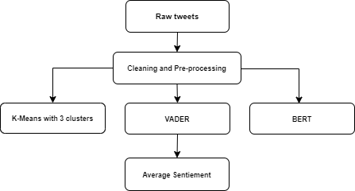
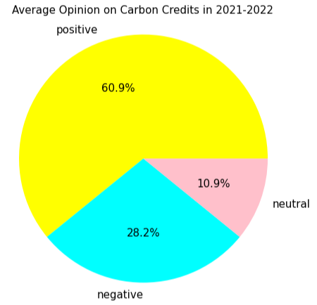

## Sentiment analysis of public opinions on the blockchain approach for carbon credit markets on Twitter.

[Dynamic Sustainability Lab](https://www.dynamicslab.org/)

I was working on a solo project of unsupervised sentiment analysis of public opinions on the blockchain approach for carbon credit markets on Twitter. 

### Project Description 
The project's goals were to analyze tweets in English that can help understand public opinion on blockchain and its role in the transition to a net-zero economy around the world and find possible correlations between the   geo-political and demographical background of those Tweets. For that purpose, various unsupervised approaches were used and evaluated.
  

  
The project's **poster** is available through [this link](reports/DSL_poster_v2.pdf). The project's **paper** is [here](reports/DSL_paper_v1.pdf).
The full code is available [here](code/). 

As a side goal, I also performed **topic modeling** on the cleaned data to discover which topics people were mostly engaged in while talking about carbon credits.
The notebook and explanation of that part can be found [here](topic_modeling.md).


### Data
In this paper, the project collects and analyzes the contents of around 225,098 English tweets that discussed either the current general perception of carbon credits or the blockchain role in the transition to a net-zero carbon economy in the past 2 years period (1/1/2021 – 10/31/2022).
  
The library used for data scraping is [snscrape](https://github.com/JustAnotherArchivist/snscrape)
The code for the Twitter data scraping part is [here](code/DSL_tweetsMine.ipynb).

 
### Methods
+ **K-Means**. First, I wanted to explore one of the most popular techniques for unsupervised sentiment analysis, K-Means clustering. The size of the dataset made it possible to create a large enough dictionary of words for the Word2vec model. I decided to work with 3 clusters: positive, negative, and neutral. The neutral cluster is supposed to collect possible spam tweets or tweets with not enough information for humans to determine the sentiment.
  
+ **VADER** (Valence Aware Dictionary and sEntiment Reasoner). Second, I imported and applied the VADER algorithm on the same per-processed text as that given to K-Means. VADER is a key-based algorithm for sentiment analysis, which means it has its own dictionary of words for sentiment classification.
  
+ **BERT** (Bidirectional Encoder Representations for Transformers). Finally, I decided to run BERT, which is a model with pre-trained language representations that has an internal library for sentiment analysis. BERT is able to identify sentiment based on common keywords, sentence structure, as well as the context of each tweet based on the generated embeddings. By design, BERT is able to identify either positive or negative tweets. It is one of the most advanced unsupervised methods for sentiment analysis yet and I wanted to see how similar its results are to the K-Means model.


### Pre-processing
  
Import necessary libraries and functions.
```
from nltk.corpus import stopwords
from nltk.tokenize import word_tokenize
from nltk.stem import WordNetLemmatizer
  
lemma = WordNetLemmatizer()
stop_words = set(stopwords.words('english'))
```

Write a function to clean and tokenize the data:
```
def clean_tweet(tweet):
    if type(tweet) == float:
            return ""

    # turn text into lower
    test = tweet.lower()
    # remove all mentions and hashtags 
    test = re.sub("@[A-Za-z0-9_]+","", test)
    test = re.sub("#[A-Za-z0-9_]+","", test)
    #remove links
    test = re.sub(r"http\S+", "", test)
    test = re.sub(r"www.\S+", "", test)
    #remove punctuation
    test = re.sub('[()!?]', ' ', test)
    test = re.sub('\[.*?\]',' ', test)
    #remove non alphabetical characters
    test = re.sub("[^a-z0-9]"," ", test)
    #remove extra spaces
    test = re.sub(' +', ' ', test)
    
    #remove many abbreviations
    test = re.sub(r"there's", "there is", test)
    test = re.sub(r"i'm", "i am", test)
    test = re.sub(r"he's", "he is", test)
    test = re.sub(r"she's", "she is", test)
    test = re.sub(r"it's", "it is", test)
    test = re.sub(r"that's", "that is", test)
    test = re.sub(r"what's", "that is", test)
    test = re.sub(r"where's", "where is", test)
    test = re.sub(r"how's", "how is", test)
    test = re.sub(r"\'ll", " will", test)
    test = re.sub(r"\'ve", " have", test)
    test = re.sub(r"\'re", " are", test)
    test = re.sub(r"\'d", " would", test)
    test = re.sub(r"\'re", " are", test)
    test = re.sub(r"won't", "will not", test)
    test = re.sub(r"can't", "cannot", test)
    test = re.sub(r"n't", " not", test)
    test = re.sub(r"n'", "ng", test)
    test = re.sub(r"'bout", "about", test)
    test = re.sub(r"'til", "until", test)
    test = re.sub(r"\"", "", test)
    test = re.sub(r"\'", "", test)
    test = re.sub(r' s ', "", test)
    test = re.sub(r"[\[\]\\0-9()\"$#%/@;:<>{}`+=~|.!?,-]", "", test)
    test = re.sub(r"&", "", test)
    test = re.sub(r"\\n", "", test)
    
    # remove single letter words
    test = ' '.join( [w for w in test.split() if len(w)>1] )
    
    test = ' '.join( [lemma.lemmatize(x) for x in nltk.wordpunct_tokenize(test) if x not in stop_words])
    test =[lemma.lemmatize(x, nltk.corpus.reader.wordnet.VERB) for x in nltk.wordpunct_tokenize(test) if x not in stop_words]

    return test
```


### KMeans Implementation

Create embedding vectors from tweets using the [Gensim library](https://radimrehurek.com/gensim/models/word2vec.html):
```
sent = [row for row in data18["clean_tweet"]]
# use Gensim Phrases package to automatically detect common phrases (bigrams) from a list of sentences.
phrases = Phrases(sent, min_count=1, progress_per=50000)
bigram = gensim.models.phrases.Phraser(phrases)
sentences = bigram[sent]
sentences[1]

# https://www.kaggle.com/pierremegret/gensim-word2vec-tutorial
```
Initialize Word2vec model:
```
#Initializing the word2vec model
w2v_model = Word2Vec(min_count=4,
                     window=5,
                     vector_size =300,
                     sample=1e-5, 
                     alpha=0.03, 
                     min_alpha=0.0007, 
                     negative=20,
                     seed= 42,
                     workers=multiprocessing.cpu_count()-1)


#building vocab of the word2vec model from the custom data
w2v_model.build_vocab(sentences, progress_per=50000)

# https://towardsdatascience.com/unsupervised-sentiment-analysis-a38bf1906483
```
Train Word2vec model:
```
w2v_model.train(sentences, total_examples=w2v_model.corpus_count, epochs=60, report_delay=1)
```
Feeding the embeddings to a KMeans model to cluster words into positive, negative, and neutral clusters:
```
model = KMeans(n_clusters=3, max_iter=1000, random_state=42, n_init=50).fit(X=word_vectors.vectors.astype('double'))
```
Create a dictionary of the word and its cluster value:
```
words_dict = dict(zip(words.words, words.cluster_value))
```
Define a function to get the sentiment for the entire tweet:
```
def get_sentiments(x,words_dict):
    total=0
    count=0
    test=x["clean_tweet"]
    #print(test)
    for t in test:
        if words_dict.get(t):
            total+=int(words_dict.get(t))
            #print('adding', int(words_dict.get(t)))
        count+=1
    if count == 0:
        sentiment = 'no data'
    else:
        avg=total/count
        sentiment=-1 if avg<-0.15 else 1 if avg >0.15 else 0
    return sentiment
```
Apply the function on the dataset:
```
for i in range(len(data18)):
    x = data18.iloc[i]
    data18['sentiment'][i] = get_sentiments(x, words_dict)
```


### VADER Implementation

Import the sentiment analyzer:
```
nltk.download('vader_lexicon')
sid = SentimentIntensityAnalyzer()
```
Apply the polarity function to calculate the sentiment scores:
```
data18['sentiments_val2'] = data18['cleaned_tweet'].apply(lambda tweet: sid.polarity_scores(tweet))
```
Calculate the compound score for each tweet:
```
data18['compound']  = data18['sentiments_val2'].apply(lambda score_dict: score_dict['compound'])
```
Write a function to cluster the tweets based on compound value:
```
def sentimentPredict(score):
    if score >= 0.05:
        return "positive"
    elif score <= -0.05: 
        return "negative"
    else:
        return "neutral"

data18['sentiments_val2'] =data18['compound'].apply(lambda x: sentimentPredict(x))
```


### BERT Implementation

Install necessary libraries:
```
# installing the library 'transformers' which contains BERT implementation
!pip install transformers
 
# installing the library tensorflow
!pip install tensorflow

# importing the pipeline module
from transformers import pipeline
 
# Downloading the sentiment analysis model
SentimentClassifier = pipeline("sentiment-analysis")
```
Write a BERT function to apply to the dataset:
```
def FunctionBERTSentiment(inpText):
  return(SentimentClassifier(inpText)[0]['label'])
```
Calling BERT-based sentiment score function for every tweet:
```
data18['sentiments_val3']=data18['cleaned_tweet'].apply(FunctionBERTSentiment)
```


### Average and final plots

Turn all the sentiments into numbers:
```
def sentimentNum(score):
    if score == 'positive':
        return 1
    elif score == 'negative': 
        return -1
    else:
        return 0

# sentiment values refer to KMeans, VADER, and BERT
data18['sentiments_val'] =data18['sentiments_val'].apply(lambda x: sentimentNum(x))
data18['sentiments_val2'] =data18['sentiments_val2'].apply(lambda x: sentimentNum(x))
data18['sentiments_val3'] =data18['sentiments_val3'].apply(lambda x: sentimentNum(x))
```
Write a function to average the results and cluster them into sentiments:
```
def sentimentAvg(val1, val2, val3):
    summ = val1 + val2 + val3
    if summ >= 1:
        return 'positive'
    elif summ < 0: 
        return 'negative'
    else:
        return 'neutral'

data18['sent_avg'] = data18.apply(lambda x: sentimentAvg(val1 = x['sentiments_val'], val2 = x['sentiments_val2'], val3 = x['sentiments_val3']), axis=1)
```
Create a pie chart for the final average results (you can repeat the step for individual algorithms and compare results):
```
data_pie=data18["sent_avg"].value_counts().reset_index()
fig = plt.gcf()
fig.set_size_inches(7,7)
colors = ["yellow","cyan","pink"]
plt.pie(data_pie["sent_avg"],labels=data_pie["index"],radius=2,autopct="%1.1f%%", colors=colors)
plt.axis('equal')
plt.title("On Average: Sentiment Distribution of Tweets 2021", fontsize=20)
#plt.savefig("images/Sentiment_Distribution.png")
plt.show()
data_pie

plt.savefig("sent_dist_tweets_avg.png")
```

  
  

For the full code files, go [here](code/).

