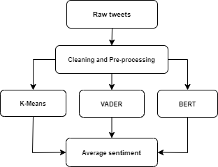

# Sentiment analysis of public opinions on the blockchain approach for carbon credit markets on Twitter.
I'm working on a solo project of sentiment analysis of public opinions on the blockchain approach for carbon credit markets on Twitter. 

### Porject Description 

The project's goals were to analyze tweets in English that can help understand public opinion on blockchain and its role in the transition to a net-zero economy around the world and find possible correlations between the geo-political and demographical background of those Tweets.

First, the project collects data on tweets about either current general perception or blockchain's role in the transition to a net-zero carbon economy. After that, I preprocess the data by cleaning, tokenizing, lemmatizing, removing stop words, and applying dimensionality reduction techniques when needed to prepare it for the training step. Next, I use unsupervised learning (word2vec with KMeans) to split preprocessed data into a desirable number of sentiments by considering keywords and hashtags. Finally, I use NLTK’s Sentiment Intensity Analyzer (VADER) and pre-trained BERT models to compare the sentiment polarity of every tweet (whether the opinion is positive, negative, or neutral) to the results of my custom model and prepare the results for publication as a journal article.

#### Data

#### Methods
