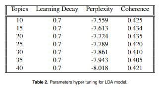

## Topic modeling of tweets on the blockchain approach for carbon credit markets.

[Dynamic Sustainability Lab](https://www.dynamicslab.org/)

Here, I expand my research to examine the topics people were talking about when they mentioned carbon credits or Net Zero. I used [Linear Discriminant Analysis](https://scikit-learn.org/stable/modules/generated/sklearn.discriminant_analysis.LinearDiscriminantAnalysis.html) on the cleaned training data. Latent Dirichlet Allocation (LDA) is a Bayesian network that explains a set of observations through unobserved groups, and each group explains why some parts of the data are similar.

### Required libraries 
```
#Base and Cleaning 
import json
import requests
import pandas as pd
import numpy as np
import emoji
import regex
import re
import string
from collections import Counter

#Visualizations
import plotly.express as px
import seaborn as sns
import matplotlib.pyplot as plt 
#import pyLDAvis.gensim
import chart_studio
import chart_studio.plotly as py 
import chart_studio.tools as tls

#Natural Language Processing (NLP)
import spacy
import gensim
from spacy.tokenizer import Tokenizer
from gensim.corpora import Dictionary
from gensim.models.ldamulticore import LdaMulticore
from gensim.models.coherencemodel import CoherenceModel
from gensim.parsing.preprocessing import STOPWORDS as SW
from sklearn.decomposition import LatentDirichletAllocation, TruncatedSVD
from sklearn.feature_extraction.text import CountVectorizer, TfidfVectorizer
from sklearn.model_selection import GridSearchCV
from pprint import pprint
from wordcloud import STOPWORDS
stopwords = set(STOPWORDS)
```

### Cleaning and pre-processing 

Import necessary tools:
```
from nltk.corpus import stopwords
from nltk.tokenize import word_tokenize
from nltk.stem import WordNetLemmatizer
  
lemma = WordNetLemmatizer()
stop_words = set(stopwords.words('english'))
```
Write the function to clean the tweet and tokenize them:
```
def clean_tweet(tweet):
    if type(tweet) == float:
            return ""

    # turn text into lower
    test = tweet.lower()
    # remove all mentions and hashtags 
    test = re.sub("@[A-Za-z0-9_]+","", test)
    test = re.sub("#[A-Za-z0-9_]+","", test)
    #remove links
    test = re.sub(r"http\S+", "", test)
    test = re.sub(r"www.\S+", "", test)
    #remove punctuation
    test = re.sub('[()!?]', ' ', test)
    test = re.sub('\[.*?\]',' ', test)
    #remove non alphabetical characters
    test = re.sub("[^a-z0-9]"," ", test)
    #remove extra spaces
    test = re.sub(' +', ' ', test)
    # remove single letter words
    test = ' '.join( [w for w in test.split() if len(w)>1] )
    
    test = ' '.join( [lemma.lemmatize(x) for x in nltk.wordpunct_tokenize(test) if x not in stop_words])
    test =[lemma.lemmatize(x, nltk.corpus.reader.wordnet.VERB) for x in nltk.wordpunct_tokenize(test) if x not in stop_words]

    return test

# clean the tweets and create two columns: tokenized tweet and whole tweet
data21["clean_tweet"]=data21["Tweet"].apply(lambda x:clean_tweet(x))
```

### LDA method

Create a id2word dictionary:
```
id2word = Dictionary(data21["clean_tweet"])
print(len(id2word))

# https://towardsdatascience.com/twitter-topic-modeling-e0e3315b12e2
```
Filter Extremes:
```
id2word.filter_extremes(no_below=2, no_above=.99)
print(len(id2word))

# https://towardsdatascience.com/twitter-topic-modeling-e0e3315b12e2
```
Create a corpus object:
```
corpus = [id2word.doc2bow(d) for d in data21["clean_tweet"]]

# https://towardsdatascience.com/twitter-topic-modeling-e0e3315b12e2
```
Instantiate a Base LDA model:
```
base_model = LdaMulticore(corpus=corpus, num_topics=5, id2word=id2word, workers=12, passes=5)
```
Filter for words:
```
words = [re.findall(r'"([^"]*)"',t[1]) for t in base_model.print_topics()]
```
Create Topics: 
```
topics = [' '.join(t[0:10]) for t in words]
```
Get the topics:
```
for id, t in enumerate(topics): 
    print(f"------ Topic {id} ------")
    print(t, end="\n\n")
```
```
------ Topic 0 ------
energy read amp emission build new uk help reach transition

------ Topic 1 ------
carbon amp market emission need credit offset climate new plan

------ Topic 2 ------
amp energy climate need gas year make power green emission

------ Topic 3 ------
amp help business support project work great u new join

------ Topic 4 ------
zero net amp climate join emission 2022 target achieve transition
```
Compute Perplexity:
```
# a measure of how good the model is. lower the better
base_perplexity = base_model.log_perplexity(corpus)
print('\nPerplexity: ', base_perplexity) 

# Compute Coherence Score
coherence_model = CoherenceModel(model=base_model, texts=data21["clean_tweet"], 
                                   dictionary=id2word, coherence='c_v')
coherence_lda_model_base = coherence_model.get_coherence()
print('\nCoherence Score: ', coherence_lda_model_base)
```
```
Perplexity:  -7.6634265387024385

Coherence Score:  0.3637468757745862
```

### Hypertuning
To hyper-tune the model, I used several components or topics and the learning rate of the model. Those parameters control how many meaningful labels the model tries to learn from the data. The learning rate affects
the convergence of the loss function and so influences the quality of discovered topics. To measure the performance of the model, I used perplexity and coherence scores. Perplexity metric is widely used for language model evaluation and is monotonically decreasing in the likelihood of the test data, and is algebraically equivalent to the inverse of the geometric mean per-word likelihood. A lower perplexity score indicates better generalization performance. The coherence score reflects the interpretability of the resulting topics or themes. The lower the score, the hard it is to interpret or understand topics.

```
gs_start_time = time.time()

# Define Search Param
search_params = {'n_components': [10, 15, 20], 'learning_decay': [.5, .7, .9]}

# Init the Model
lda = LatentDirichletAllocation()

# Init Grid Search Class
model = GridSearchCV(lda, param_grid=search_params)

# Do the Grid Search
model.fit(data_vectorized)
GridSearchCV(cv=None, error_score='raise',
             estimator=LatentDirichletAllocation(batch_size=128, 
                                                 doc_topic_prior=None,
                                                 evaluate_every=-1, 
                                                 learning_decay=0.7, 
                                                 learning_method=None,
                                                 learning_offset=10.0, 
                                                 max_doc_update_iter=100, 
                                                 max_iter=10,
                                                 mean_change_tol=0.001, 
                                                 n_components=10, 
                                                 n_jobs=1,
                                                 perp_tol=0.1, 
                                                 random_state=None,
                                                 topic_word_prior=None, 
                                                 total_samples=1000000.0, 
                                                 verbose=0),
             n_jobs=None,
             param_grid={'n_topics': [10, 15, 20], 
                         'learning_decay': [0.5, 0.7, 0.9]},
             pre_dispatch='2*n_jobs', refit=True, return_train_score=False,
             scoring=None, verbose=0)

gs_end_time = time.time()
```



The table above shows the results of the cross-validation with learning decay and a number of topics as tuning parameters. The most effective learning decay rate was 0.7 and the most optimal number of topics was 20 with the final coherence score of 43.5%.


